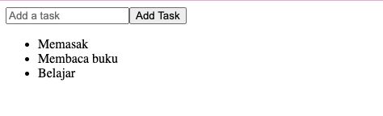

### 1. Registration Form

Tulislah sebuah komponen React bernama RegistrationForm yang memungkinkan pengguna untuk mengisi formulir pendaftaran dengan nama dan email. Komponen ini harus memiliki dua input field: satu untuk nama dan satu untuk email, serta tombol untuk mengirimkan formulir. Data formulir harus disimpan dalam state lokal dan ditampilkan di bawah formulir ketika tombol diklik. Tidak perlu styling.

Petunjuk:

- Gunakan state lokal untuk menyimpan nama dan email.
- Setelah mengklik tombol "Submit", tampilkan data yang diisi di bawah formulir.

Contoh Output :

Sebelum input data

Setelah submit data

### 2. Shopping List

Buatlah sebuah komponen React bernama ShoppingList yang memungkinkan pengguna untuk menambahkan input item ke dalam daftar belanja. Setiap item yang ditambahkan harus ditampilkan dalam daftar di bawah input field.

Petunjuk:

- Gunakan state lokal untuk menyimpan daftar item.
- Setiap kali pengguna menambahkan item, item tersebut harus muncul dalam daftar.

Contoh Output :

Sebelum input item belanja

Setelah input item belanja

### 3. Button Counter

Diberikan sebuah komponen React yang berisi bug. Tugas mu adalah menemukan dan memperbaiki bug tersebut agar komponen berfungsi dengan benar. Komponen ini harus menampilkan sebuah angka dan memiliki dua tombol: satu untuk menambah angka dan satu lagi untuk menguranginya.

Petunjuk :

- angka Count akan bertambah 1 jika tombol Increment di klik
- angka Count akan berkurang 1 jika tombol Decrement di klik

Contoh Output :

### 4. Task List

Buatlah aplikasi sederhana dengan React dan Redux yang memungkinkan User untuk menambahkan tugas ke dalam daftar dan menampilkan daftar tugas tersebut. Aplikasi ini harus menggunakan Redux untuk mengelola state daftar tugas.

Petunjuk:

- Gunakan Redux untuk mengelola state.
- Buat store, action dan reducer untuk menambahkan tugas.

Contoh Output :

Sebelum task di input

Setelah task di input

